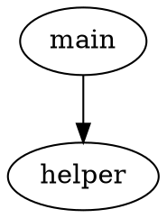

# ReverseTool

[](https://pypi.org/project/reverse-tool/)
[](https://pypi.org/project/reverse-tool/)
[](https://github.com/bolin8017/ReverseTool/actions/workflows/ci.yml)
[](https://opensource.org/licenses/MIT)

> Binary analysis feature extraction framework powered by Ghidra and Radare2.

ReverseTool extracts structured features from binary files for malware classification, similarity analysis, and threat hunting. It provides a unified CLI and Python API across multiple reverse engineering backends.

## Highlights

- **Multi-backend**: Unified interface for Ghidra 12.0.4 and Radare2 6.1.2
- **Pluggable extractors**: Auto-discovered plugin architecture — add new extractors in ~50 lines
- **Docker-first**: Pre-configured images with all tools included — zero setup
- **Parallel processing**: Batch-analyze thousands of binaries with ProcessPoolExecutor

## Quick Start

### Docker (recommended — zero setup)

```bash
# Pull the image
docker pull ghcr.io/bolin8017/reverse-tool:latest

# Extract opcodes using Radare2
docker run -v $(pwd)/samples:/data:ro -v $(pwd)/output:/output \
  ghcr.io/bolin8017/reverse-tool opcode -b radare2 -d /data -o /output

# Extract function call graphs using Ghidra
docker run -v $(pwd)/samples:/data:ro -v $(pwd)/output:/output \
  ghcr.io/bolin8017/reverse-tool function-call -b ghidra -d /data -o /output
```

### pip install

```bash
pip install reverse-tool

# Install with backend dependencies
pip install reverse-tool[radare2]    # Adds r2pipe
pip install reverse-tool[ghidra]     # Adds pyghidra
```

## CLI Usage

### Global Options

```bash
reverse-tool --version              # Show version
reverse-tool --help                 # Show all commands
reverse-tool -v opcode ...          # Verbose output
reverse-tool -vv opcode ...         # Debug output
reverse-tool -q opcode ...          # Quiet mode (paths only)
```

### Opcode Extraction

Extracts opcode mnemonics from all sections of binary files. Output: CSV.

```bash
# Basic usage with Radare2
reverse-tool opcode -b radare2 -d /path/to/binaries

# With Ghidra (specify analyzeHeadless path)
reverse-tool opcode -b ghidra -d /path/to/binaries \
  -g ~/ghidra_12.0.4/support/analyzeHeadless

# Custom output directory and timeout
reverse-tool opcode -b radare2 -d /path/to/binaries \
  -o /path/to/output -t 1200

# Filter specific file types
reverse-tool opcode -b radare2 -d /path/to/binaries --pattern "*.exe"
reverse-tool opcode -b radare2 -d /path/to/binaries --pattern "*.elf"
```

**Output format (CSV):**

```csv
addr,opcode,section_name
4194356,nop,.text
4194360,mov,.text
4194368,push,.text
```

### Function Call Extraction

Extracts function call graphs and per-function disassembly. Output: DOT + JSON.

```bash
# Basic usage with Radare2
reverse-tool function-call -b radare2 -d /path/to/binaries

# With Ghidra
reverse-tool function-call -b ghidra -d /path/to/binaries \
  -g ~/ghidra_12.0.4/support/analyzeHeadless

# Custom output and timeout
reverse-tool function-call -b radare2 -d /path/to/binaries \
  -o /path/to/output -t 1200 --pattern "*.exe"
```

**Output format (DOT):**



**Output format (JSON):**

```json
{
    "0x1000": {
        "function_name": "main",
        "instructions": ["push rbp", "mov rbp, rsp", "call 0x1050", "ret"]
    }
}
```

### Environment Check

```bash
# Check all dependencies
reverse-tool doctor

# List available backends
reverse-tool backends
```

**Example `doctor` output:**

```
ReverseTool v0.1.0
Python:   3.12.11
Platform: Linux-5.15.0-x86_64
Ghidra:   found (/opt/ghidra/support/analyzeHeadless)
Radare2:  found (/opt/radare2/bin/r2)
Extractors: 2 registered
  - function_call
  - opcode
```

## Docker Images

| Image | Size | Contents |
|-------|------|----------|
| `reverse-tool:latest` | ~1.08GB | Ghidra 12.0.4 + Radare2 6.1.2 |
| `reverse-tool:ghidra` | ~1.02GB | Ghidra 12.0.4 only |
| `reverse-tool:radare2` | ~200MB | Radare2 6.1.2 only |

```bash
# Build locally
docker build --target full -t reverse-tool:latest -f docker/Dockerfile .
docker build --target radare2-only -t reverse-tool:radare2 -f docker/Dockerfile .
docker build --target ghidra-only -t reverse-tool:ghidra -f docker/Dockerfile .

# Interactive debugging
docker run -it --entrypoint bash reverse-tool:latest

# Use Radare2 directly
docker run --rm reverse-tool:latest r2 -v
```

## Architecture

```
reverse-tool <extractor> -b <backend> -d <directory>
       │
       ▼
   ┌─────────┐     ┌──────────────┐     ┌─────────────┐
   │   CLI   │────▶│    Engine    │────▶│   Backend   │
   │ (Click) │     │ (Parallel)   │     │ (Ghidra/r2) │
   └─────────┘     └──────┬───────┘     └──────┬──────┘
                          │                     │
                          ▼                     ▼
                   ┌──────────────┐     ┌──────────────┐
                   │  Extractor   │◀────│   Session    │
                   │ (opcode/fc)  │     │  (context    │
                   └──────┬───────┘     │   manager)   │
                          │             └──────────────┘
                          ▼
                   ┌──────────────┐
                   │   Writer    │
                   │ (CSV/DOT/   │
                   │  JSON)      │
                   └──────────────┘
```

**Key design decisions:**
- **Extractor-centric architecture**: Organized by what you extract, not which tool you use
- **Auto-discovery**: New extractors auto-register via `__init_subclass__`
- **Context manager sessions**: Backend sessions are always properly cleaned up
- **Generic typing**: `BaseBackend[T_Session]` provides type-safe session handles

## Adding a Custom Extractor

```python
# src/reverse_tool/extractors/my_feature/__init__.py
from reverse_tool.extractors import BaseExtractor, ExtractResult

class MyFeatureExtractor(BaseExtractor):
    @property
    def name(self) -> str:
        return "my_feature"

    @property
    def description(self) -> str:
        return "Extract my feature from binaries"

    @property
    def supported_backends(self) -> frozenset[str]:
        return frozenset({"ghidra", "radare2"})

    def extract(self, session, input_file, logger):
        # Your extraction logic here
        return ExtractResult(extractor_name=self.name, input_file=input_file, data={})

    def write_output(self, result, output_dir):
        # Write results to disk, return list of created file paths
        return []
```

That's it — the extractor auto-registers and appears as `reverse-tool my-feature` in the CLI.

See [CONTRIBUTING.md](CONTRIBUTING.md) for the full tutorial.

## Configuration

Optional config file at `~/.config/reverse-tool/config.toml`:

```toml
[defaults]
backend = "ghidra"
timeout = 1200

[backends.ghidra]
path = "/opt/ghidra_12.0.4/support/analyzeHeadless"

[backends.radare2]
analysis_level = "aa"
```

Priority: CLI flags > environment variables > config file > defaults.

## Development

```bash
# Setup
git clone https://github.com/bolin8017/ReverseTool.git
cd ReverseTool
python3.12 -m venv .venv && source .venv/bin/activate
pip install -e ".[dev]"

# Quality checks
just lint          # ruff check + format
just typecheck     # mypy
just test          # pytest (unit tests)
just test-cov      # pytest with coverage
just check         # all of the above
```

## Contributing

See [CONTRIBUTING.md](CONTRIBUTING.md) for development setup, coding standards, and the guide to adding new extractors.

## License

[MIT](LICENSE)

## Citation

If you use ReverseTool in academic research, please cite:

```bibtex
@software{reversetool,
  title = {ReverseTool: Binary Analysis Feature Extraction Framework},
  author = {PolinLai},
  url = {https://github.com/bolin8017/ReverseTool},
  license = {MIT},
  year = {2026}
}
```
